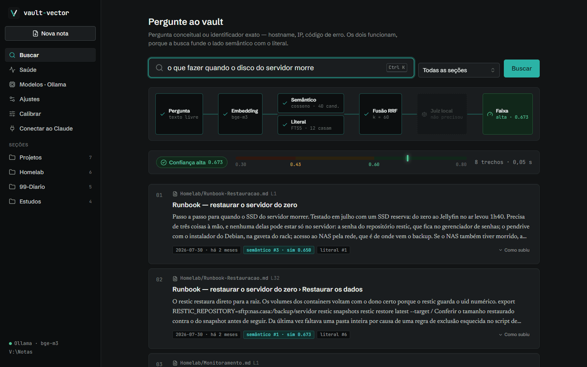
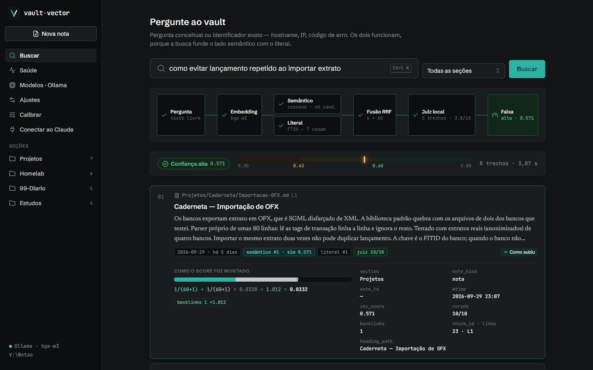
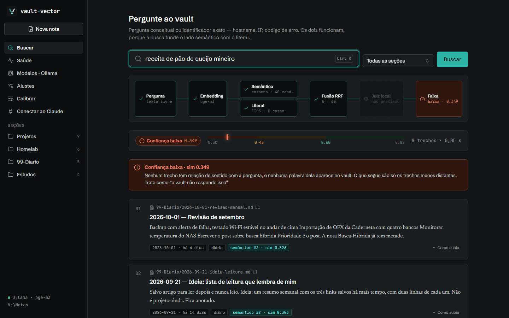
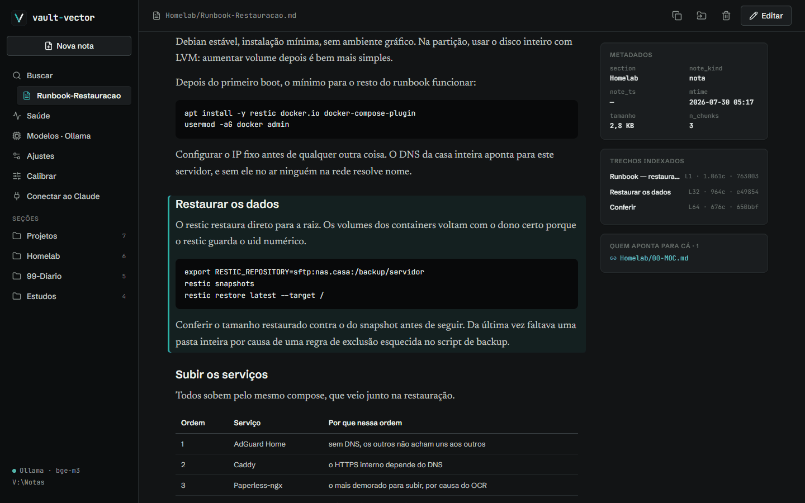
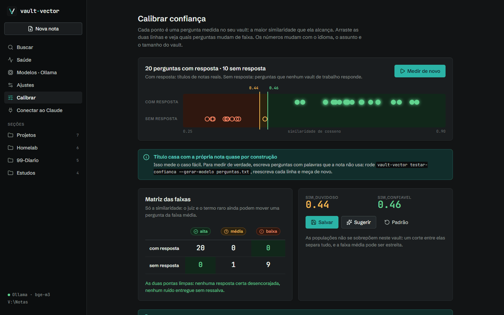
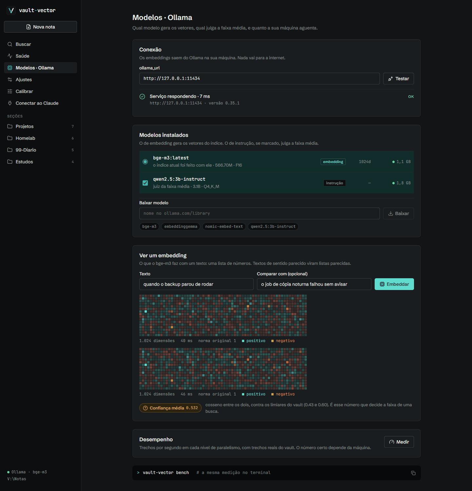
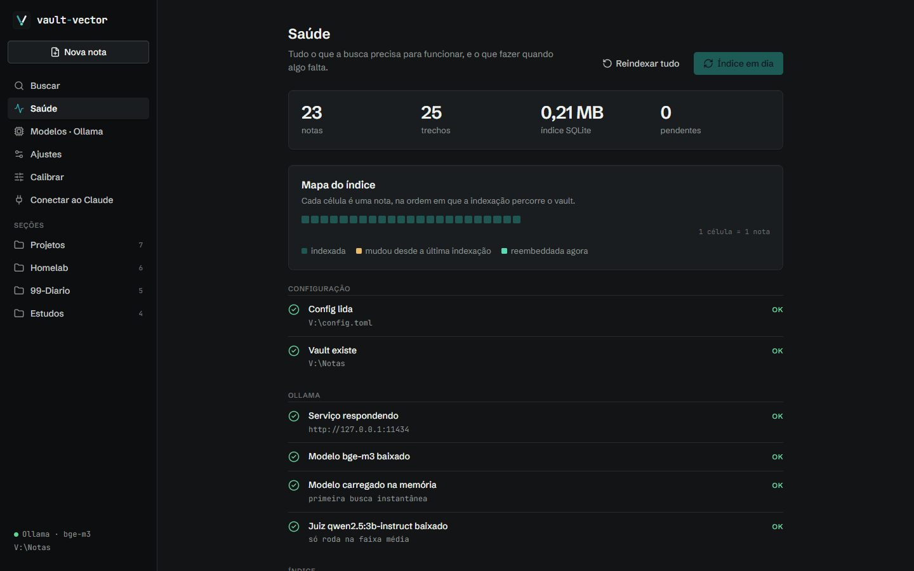

# vault-vector

Busca semântica e escrita nas suas notas markdown, para você e para o Claude. Roda inteiro na sua máquina: os embeddings saem do Ollama, o índice é um arquivo SQLite local e nada vai para a nuvem. Funciona com o Obsidian fechado, ou sem Obsidian nenhum.

São duas portas para o mesmo vault. O **app de desktop** abre com o Windows, fica na bandeja e responde a Ctrl+Alt+Espaço de qualquer programa. O **servidor MCP** dá ao Claude Code e ao Claude Desktop as mesmas ferramentas de busca e escrita, no mesmo processo.



```powershell
powershell -ExecutionPolicy Bypass -File .\setup.ps1
```

O setup instala o pacote, compila a interface e abre o app num passo a passo: escolher a pasta das notas (um vault do Obsidian, uma pasta qualquer ou nenhuma), conferir o Ollama e o modelo, e indexar. Nenhum arquivo de configuração para editar.

---

## O que faz

**Busca híbrida.** Similaridade vetorial e busca literal (FTS5) fundidas por Reciprocal Rank Fusion. Funciona tanto para pergunta conceitual ("como decidi o particionamento das VLANs") quanto para identificador exato (hostname, IP, código de erro), já que os dois lados cobrem falhas diferentes um do outro.

**Sinalização de incerteza.** Cada busca sai com uma faixa de confiança, e a tela diz o motivo de cada ressalva. Foi a parte que levou mais trabalho e está explicada na seção [Quando o vault não tem a resposta](#quando-o-vault-não-tem-a-resposta).

**Escrita com histórico.** Editar, acrescentar, criar, mover e apagar, tanto pelo app quanto pelas ferramentas MCP. Toda gravação copia a versão anterior para `_historico/` antes de escrever, recusa gravar se a nota mudou no disco desde a leitura, e mover uma nota reescreve os wikilinks que apontavam para ela.

**Descrição automática do vault.** O servidor lê o próprio índice e monta para o modelo a descrição da estrutura: seções, subpastas, convenções de diário e de índice. Como nada disso fica embutido no código, o Claude consegue navegar um vault que nunca viu sem que você escreva instruções para ele.

**Uso sem vault prévio.** Para quem quer apenas uma memória persistente onde o Claude escreve e consulta, o primeiro uso cria a pasta com a estrutura que a busca aproveita: diário com data no nome, MOC por seção, títulos como fronteira de trecho.

---

## O app

Cada tela mostra o que o motor está fazendo, com os números reais do seu vault.

| | |
|---|---|
|  |  |
| **Busca.** O pipeline acende conforme a requisição anda e mostra o que de fato aconteceu: quantos trechos casaram no literal, se o juiz rodou. "Como subiu" abre a conta do score, RRF vezes cada fator de boost com o nome do motivo. | **Pergunta sem resposta.** Quando o vault não fala do assunto, a busca diz isso em vez de entregar o trecho menos distante como se fosse resposta. |
|  |  |
| **Nota.** Leitura em markdown, com a seção do trecho encontrado destacada. Edição com Ctrl+S, histórico com restauração, mover com reescrita de wikilinks. Sair do editor sem salvar não perde o texto. | **Calibrar.** Mede no seu vault as perguntas que ele responde e as que não responde, e mostra onde cortar. Arrastar as linhas mostra quais perguntas mudam de faixa. |
|  |  |
| **Modelos.** O vetor que o modelo devolve, e o cosseno entre dois textos contra os limiares do vault. Trocar o modelo de embedding dispara a reindexação completa. | **Saúde.** O mesmo diagnóstico do `vault-vector doctor`, com a dica de cada falta, e o mapa das notas que mudaram desde a última indexação. |

Também tem **Ajustes**, com cada variável do `config.toml`, o motivo medido de cada padrão e a prévia de como uma nota real fica cortada, e **Conectar ao Claude**, com os comandos prontos para esta máquina.

---

## Quando o vault não tem a resposta

Um sistema de busca por similaridade sempre devolve os `top_k` trechos mais parecidos. Quando a pergunta não tem resposta no corpus, ele devolve os menos distantes com a mesma aparência de acerto, e o modelo de linguagem que lê esses trechos responde a partir deles.

O caso que expôs isso aqui foi uma pergunta de culinária contra um vault de infraestrutura e desenvolvimento: ela tirou o **maior score da sessão**, acima de perguntas cuja resposta estava no vault. Uma palavra da pergunta tinha homônimo no corpus, e os dois rankers concordaram com força. O score do RRF mede concordância entre rankers, e concordância não separa o caso em que os dois acertaram do caso em que os dois erraram junto.

### Piso de similaridade não resolveu

A primeira correção foi cortar resultados abaixo de um limiar de cosseno. Medindo as duas populações:

| População | faixa de similaridade |
|---|---|
| Pergunta sem resposta no vault | 0,387 – 0,527 |
| Pergunta legítima com vocabulário diferente do das notas | 0,435 – 0,607 |

As duas se sobrepõem em quase toda a extensão, então qualquer corte único ou deixa passar ruído ou recusa pergunta boa. Com o piso em 0,55, três de cinco perguntas legítimas verificáveis foram recusadas, uma delas com a nota correta em primeiro lugar.

### Faixas de confiança

O resultado sai sempre, classificado em três faixas, com a incerteza anexada a ele:

| Faixa | Critério | Saída |
|---|---|---|
| alta | ≥ 0,60, ou termo raro com cobertura | sem ressalva |
| média | 0,43 – 0,60 | *"esta faixa contém tanto pergunta legítima com outro vocabulário quanto pergunta que o vault não responde; leia o trecho e decida"* |
| baixa | < 0,43 | *"trate como o vault não responde isso"* |

Medido em 8 perguntas legítimas com vocabulário trocado contra 8 perguntas fora do domínio:

| | alta | média | baixa |
|---|---|---|---|
| **legítima** | 2 | 6 | **0** |
| **ruído** | **0** | 5 | 3 |

As duas pontas ficam limpas: nenhuma resposta correta desencorajada e nenhum ruído entregue sem ressalva. A faixa média concentra 69% dos casos com acerto perto de 50%, o que dá a medida de quanta informação a similaridade de vetor não carrega.

### Juiz local na faixa média

Na faixa média, um modelo de instrução pequeno (`qwen2.5:3b-instruct`, pelo Ollama) lê a pergunta junto com cada trecho e dá uma nota de 0 a 10. A faixa sobe ou desce pela **média** das notas, e não pela maior: com cinco tentativas e um juiz generoso, até pergunta fora do domínio acha um trecho que tira 6. Juiz fora do ar devolve a busca como era antes.

Os números acima são do vault onde o projeto nasceu e mudam com o idioma, o assunto e o tamanho do corpus. A tela Calibrar refaz a medição no seu, e no terminal:

```text
vault-vector calibrar          # mede as duas populações no seu vault
vault-vector testar-confianca  # matriz de confusão das faixas
```

---

## Como está montado

Um processo serve tudo. O app de desktop sobe o servidor numa thread, abre a janela num WebView2 e põe o ícone na bandeja; sem o app, `vault-vector serve --http` sobe o mesmo servidor sem janela.

```text
vault-vector-app ─┬─ janela (pywebview, WebView2)  ──┐
                  ├─ ícone na bandeja (pystray)      │ http://127.0.0.1:8765
                  └─ servidor (uvicorn, numa thread) ◄┘
                       ├─ /mcp   ferramentas para o Claude
                       ├─ /api   JSON para a interface
                       └─ /      interface React compilada
                            │
                 busca, escrita, diagnóstico, medições
                            │
              SQLite (FTS5 + vetores) ── Ollama (embedding e juiz)
```

| Pasta | O que tem |
|---|---|
| `vault_rag/` | o motor: recorte, indexação, busca, escrita, diagnóstico, medições, servidor MCP, API, app de desktop |
| `ui/` | a interface em React, TypeScript e Vite, com o design system em `src/componentes/ds` |
| `ferramentas/` | verificador de vazamento (roda no CI) e o gerador do vault de demonstração das screenshots |

A interface não tem lógica de domínio: busca, escrita e medição vêm dos mesmos módulos que o CLI e as ferramentas MCP usam, então os três não têm como discordar. Trabalho demorado (indexar, baixar modelo, medir) vira tarefa em segundo plano, e a tela acompanha o andamento.

### Segurança local

O servidor escuta só em 127.0.0.1, e isso não basta: qualquer página aberta no navegador consegue mandar requisição para localhost. Três travas, cada uma fechando um caminho diferente:

- **Host.** Um site pode apontar o próprio domínio para 127.0.0.1 (DNS rebinding) e virar "mesma origem" que o app. Host fora da lista é recusado.
- **Token.** Toda rota `/api` e `/mcp` exige `Authorization: Bearer`. O token vai embutido na página servida, que outra origem não consegue ler.
- **Origin.** Em escrita, origem de outro site é recusada mesmo com o token desligado.

---

## Decisões de projeto

| Ponto | Escolha | Por quê |
|---|---|---|
| Banco vetorial | SQLite + numpy | ~4.500 trechos dão 22 MB de matriz e o produto escalar leva menos de 1 ms. Extensão nativa quebra no Windows e não traz ganho mensurável nessa escala |
| Recorte | fronteira de heading | Tabela e bloco de código nunca partidos no meio; tabela grande repete o cabeçalho em cada pedaço |
| Contexto do trecho | caminho + título + trilha de headings + lead | O trecho isolado não diz de onde veio, e isso resolve sem custo de LLM |
| Devolução | small-to-big | Embedda o trecho pequeno e devolve a seção inteira, mantendo a precisão da busca sem perder contexto na leitura |
| Reindexação | reuso de vetor por hash | Editar uma linha reembedda só o trecho alterado; mudar o recorte reaproveita todo trecho que continuou igual |
| Metadados | derivados do caminho | Frontmatter é raro na prática, enquanto a convenção de pastas costuma estar lá |
| App de desktop | pywebview + pystray | Fica em Python, no mesmo processo do servidor, com a janela nativa do Windows. Electron ou Tauri trariam um segundo runtime para empacotar ao lado do Python |
| Abrir com o Windows | chave Run do usuário | Não pede administrador e aparece onde a pessoa procura para desligar: Gerenciador de Tarefas › Inicializar |
| Configuração | `config.toml` gravado linha a linha | A interface muda só a linha de cada chave e mantém os comentários que explicam de onde veio cada número |

---

## Requisitos

- Windows, para o app de desktop. O servidor MCP e o CLI rodam em qualquer sistema
- Python 3.11+
- [Ollama](https://ollama.com/download). O primeiro uso baixa o modelo de embedding (`bge-m3`, ~1,2 GB)
- Node.js 22+, só para compilar a interface

Para o app abrir com o Windows, escondido na bandeja:

```powershell
powershell -ExecutionPolicy Bypass -File .\instalar-servicos.ps1
```

O mesmo script deixa o modelo quente na memória e agenda a reindexação diária. Também dá para ligar e desligar em Ajustes, dentro do app.

### Sem interface

Quem só quer o servidor MCP instala sem o extra de desktop e configura pelo terminal:

```text
pip install -e .
vault-vector init
```

---

## Comandos

```text
vault-vector-app                  abre o app (ou Ctrl+Alt+Espaço com ele na bandeja)
vault-vector init                 instala do zero pelo terminal
vault-vector index                incremental; --force refaz tudo; --refazer-trechos
                                  corta de novo reaproveitando vetores
vault-vector search "termo"       busca pela linha de comando
vault-vector stats                total, pendências, seções
vault-vector doctor               checa Ollama, índice, busca e escrita
vault-vector calibrar             mede as faixas de confiança no seu vault
vault-vector testar-confianca     matriz de confusão das faixas
vault-vector serve --http         o servidor sem janela, para todos os clientes MCP
```

## Desenvolvimento

```text
python selftest.py                ~125 checagens, sem precisar do Ollama
npm --prefix ui test              testes da interface (Vitest)
npm --prefix ui run dev           interface com recarga, contra o servidor na 8765
python ferramentas/vault_demo.py PASTA   vault fictício, para testar sem as suas notas
```

O `npm run dev` lê o `.token` do projeto e o proxy do Vite manda o header, então a interface em desenvolvimento conversa com o servidor de verdade.

---

## Limites conhecidos

- Indexa só `.md`. PDF, imagem, anexo e `.canvas` ficam de fora.
- O juiz da faixa média é um modelo de 3B parâmetros e às vezes erra feio: dá nota 10 a um trecho do assunto vizinho e 2 ao trecho que responde, e a reordenação pelo juiz leva o trecho errado para o topo. A decisão da faixa pela média segura o caso grosseiro, e a ordem dos resultados ainda pode sair trocada.
- O `top_k` completa o resultado até o limite pedido, então as últimas posições podem vir com score muito baixo.
- Reindexação em lote pelo MCP pode estourar o tempo limite do cliente. Para lote, use o app ou o CLI.
- O app de desktop é só para Windows por enquanto. O resto do código é portátil, mas os scripts `.ps1` e a chave Run são do Windows.

## Licença

MIT.
